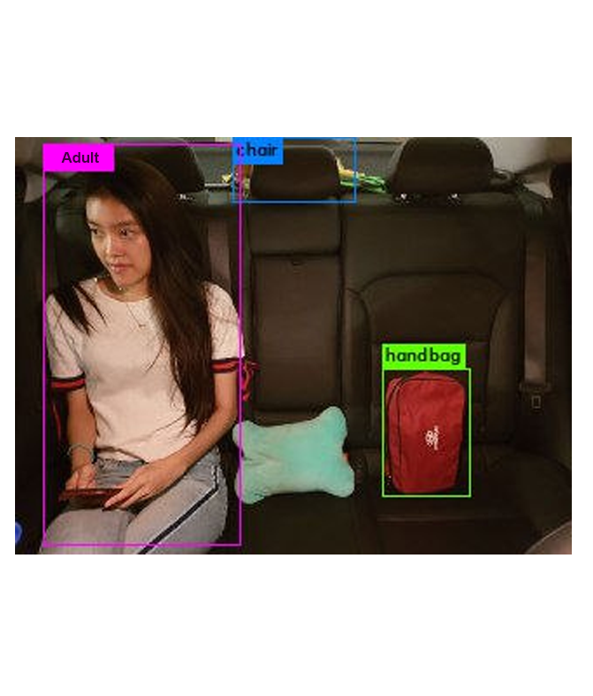
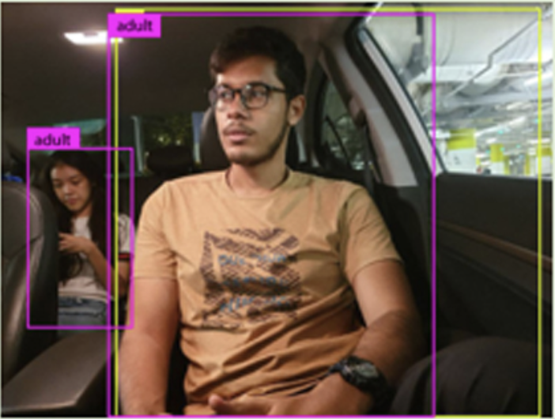

# LG-Infineon-Hackathon-PyYolo-

This repo includes the overall project outline (as can be seen in the S.I.M slides as well as poster).

It also incliudes a python file used for the project in the computer vision component. 
Here, PyYolo is used for the purpose of detecting the person(s) as well as objects in the picture as taken by the in-car camera (more details in slide/poster).

In this project, PyYolo was used for 2 main purposes:
1) To classify the objects detected in the image and determine if the objects on the car seat was a human/inanimate object, and determine if the seatbelt warning sign should appear.

2) Through the use of bounding boxes parameters (as seen in the code), to determine if the passenger(if there is one) in the front passenger seat should be allowed to be seated there or not (if child <[recommended height], then he should not be alowed to sit at the front)

